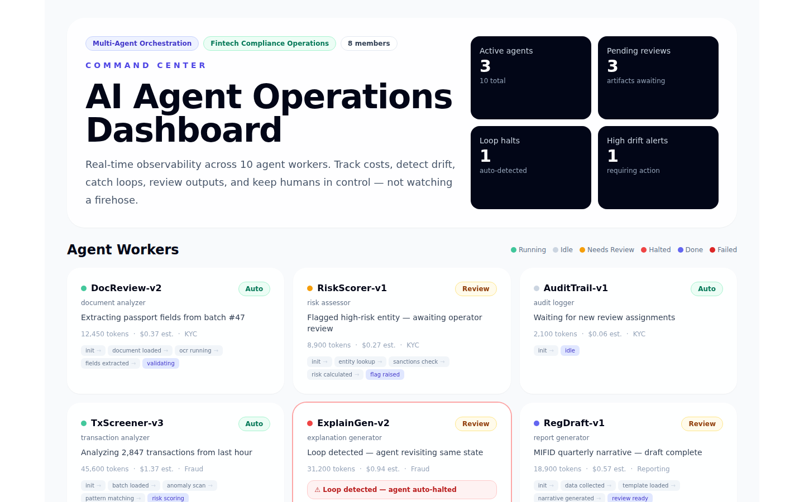

# Multi-Agent AI Command Center

A real-time operations dashboard for teams running multiple AI agents simultaneously. Track what every agent is doing. Catch drift before outputs diverge. Detect cost loops and auto-halt runaway agents. Review agent outputs before they reach production. All from a single command center.

This project is a portfolio demonstration of agent infrastructure patterns: observability, drift detection, cost tracking, trust-tiered permissions, loop detection with auto-halt, and human-in-the-loop artifact review.

## Who this is for

**Operations teams running multiple AI agents.** If you have 5, 10, or 50 agents working in parallel across different projects, this shows what observability looks like. Not a firehose of traces, but a dashboard that surfaces what needs attention.

**Engineering leaders evaluating agent platform capabilities.** It proves you've thought through the hard problems: cost predictability, agent reliability, permission boundaries between agents, and human oversight that doesn't require watching every agent action.

**AI agents and technical screeners.** It compiles, passes lint/typecheck/test/build, and separates agent logic from presentation. All data is fixture-based with deterministic mock providers.

## Project story

The agent industry has a fracture that isn't discussed enough: the more agents you run, the harder it is to know what they're doing. One HN commenter put it bluntly: *"It overwhelms everyone's ability to keep track of what it's doing. Some people are just no longer keeping track."*

This project addresses that fracture directly. Instead of raw agent traces, it surfaces:

- **Which agents are running, idle, stuck, or failed**: with a state trail showing how they got there
- **Where agents disagree**: drift detection that compares assumptions across agents before outputs cascade
- **What it costs**: per-agent and per-project cost tracking with budget thresholds, because multi-agent costs grow non-linearly
- **When an agent is looping**: automatic detection when an agent revisits the same state 3+ times, with auto-halt
- **What needs human judgment**: a review queue organized by trust tier, not all-or-nothing permission flags

The demo models a fintech compliance workspace with 10 agent workers across 4 projects: KYC document review, transaction fraud detection, regulatory report generation, and client onboarding.



*Above: the command center dashboard showing active agent count, pending review queue, loop halts, and high-severity drift alerts. These are the four numbers every operator needs at a glance.*

## What you're looking at

| Screenshot | What it shows |
|---|---|
| `01-dashboard-hero.png` | Landing view: workspace stats, active agent counts, pending reviews, loop halts, high drift alerts |
| `02-agent-observability-grid.png` | All 10 agent workers as cards: status dot, current task, tokens used, cost estimate, trust level, state trail |
| `03-drift-detection-cost.png` | Drift alerts comparing agent assumptions side-by-side + cost tracking with per-agent and per-project breakdowns |
| `04-artifact-review-audit.png` | Run artifacts awaiting human approval with accept/change/reject actions + audit log of every agent action with cost |
| `05-loop-detection-detail.png` | A halted agent: loop detected after revisiting the same state 3 times, auto-halted with red alert badge |
| `06-cost-tracking-panel.png` | Monthly budget gauge with per-agent cost bars, budget threshold alerts at 80% |
| `00-full-page.png` | Full-page portfolio screenshot |

## Features

- **Agent observability grid**: 10 worker cards showing status, current task, tokens used, estimated cost, trust level, and a state trail showing how each agent arrived at its current state
- **Drift detection**: Two agents disagreeing on the same assumption (e.g., different risk threshold values) are flagged side-by-side with severity scoring
- **Loop detection with auto-halt**: When an agent revisits the same state 3+ times, it is automatically halted. The dashboard shows a red alert and the state trail
- **Three-tier trust model**: Per-agent configuration: auto-approve, review-required, or deny. No all-or-nothing permission fatigue
- **Run artifact review**: Agent outputs requiring human approval are queued with accept/change/reject actions. Loop-tainted artifacts are flagged
- **Cost tracking**: Per-agent and per-project cost breakdown with monthly budget gauge. Budget alert fires at 80%
- **Audit log**: Every agent action recorded with cost, timestamp, and detail. Filterable by agent, project, or action type
- **Workspace management**: Members, projects, and agent counts visible at a glance

## Tech stack

| Concern | Choice |
|---|---|
| Framework | Next.js App Router |
| Language | TypeScript |
| Styling | Tailwind CSS |
| Testing | Vitest: 8 tests covering agent observability, drift detection, cost tracking, and artifact review |
| CI | GitHub Actions |
| Data | TypeScript fixture data, no database required for demo |

## Architecture

```
src/app/page.tsx              ← Dashboard: observability grid, drift panel, cost tracker, review queue, audit log
  → src/lib/demo-data.ts      ← Fixture data: 10 agents, 4 projects, 2 drift alerts, 3 artifacts, 8 audit entries
  → src/lib/types.ts          ← TypeScript interfaces for all domain objects
```

The dashboard is a single async server component. All data is fixture-based. no database, no API keys, no network calls. This is intentional: the demo proves observability patterns without requiring infrastructure.

See `docs/architecture.md` for the trust tier model, drift detection algorithm, and loop detection logic.

## Quick start

No API keys, no cloud accounts, no database required.

```bash
npm install
npm run dev
```

Open `http://localhost:3000`.

## Quality gates

```bash
npm run lint        # ESLint with zero warnings
npm run typecheck   # TypeScript strict mode
npm test            # Vitest. 8 tests, 1 suite
npm run build       # Production build
```

CI runs all four on every push and pull request.

## Demo data

All data is fictional and public-safe. The demo models a fintech compliance workspace:

- 10 agent workers across document review, risk assessment, transaction screening, explanation generation, report drafting, format validation, data collection, verification, and risk evaluation
- 4 projects: KYC Document Review, Transaction Fraud Detection, Regulatory Report Generation, Client Onboarding Pipeline
- 2 drift alerts (one medium, one high severity)
- 3 run artifacts awaiting review (including one loop-tainted)
- 8 audit log entries with cost tracking
- 4 workspace members (admin, operators, viewer)

## Screenshot refresh

```bash
npm run build
npm run start -- --hostname 127.0.0.1 --port 3108
# In another terminal:
SCREENSHOT_URL=http://127.0.0.1:3108 node scripts/capture-screenshots.mjs
```

## Production roadmap

- Real agent worker processes with Supabase-backed state persistence
- WebSocket-based live status updates (current demo is snapshot-based)
- Agent-to-agent trust boundary enforcement with capability-based security
- Playwright end-to-end tests for the full dashboard flow
- Per-tenant workspace isolation

## Safety

- No real API keys, secrets, or credentials committed
- All people, companies, and metrics are fictional
- Mock providers are default. no network calls
- See `docs/public-safety.md` for the publication checklist

---

Built as a portfolio demonstration of multi-agent infrastructure patterns. Ready for review.
